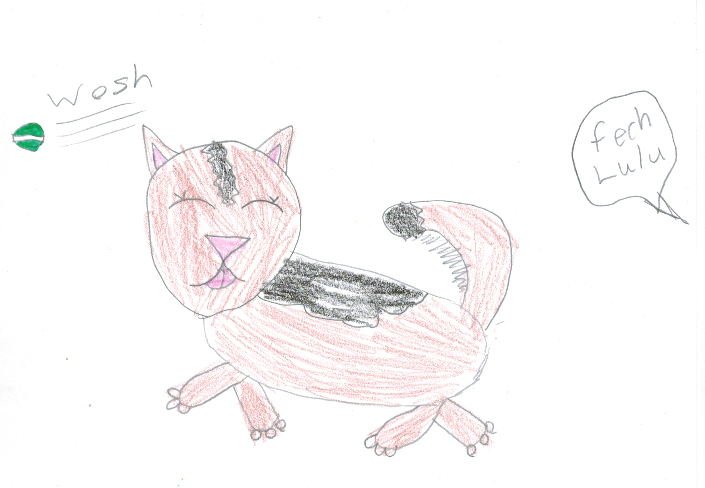

# Chapter 6: Lulu's new life

Now Lisa wakes up early in the morning to take me on a walk and she feeds me less. She also feeds me less dry hard food like she used to and instead feeds me chicken and vegetables! I've also stopped pulling on my leash because of the exercise I get every day! The second walk is after dinner and then she takes me to the dog park where I meet lots of new friends and have a good time. And two walks per day means that I don’t use the house as a toilet any more so, as you can see, me and Lisa are living happily ever after!
